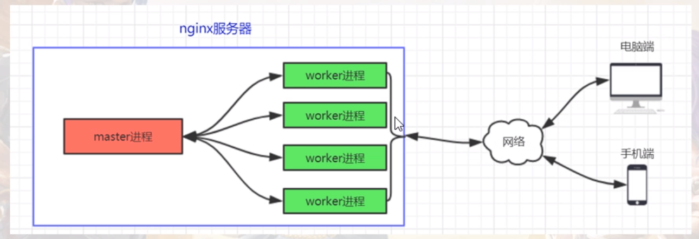

# 基础概念

## Nginx整体结构
1. 查看nginx启动后的进程
```bash
ps -ef | grep nginx
```
```
root      359223       1  0 14:21 ?        00:00:00 nginx: master process ./nginx
nobody    359224  359223  0 14:21 ?        00:00:00 nginx: worker process
```
* 第一列: UID 进程所属的用户ID
* 第二列: 进程ID(PID)，用来唯一的标识一个进程
* 第三列: 父进程ID(PPID)，使用nginx中的fork()函数创建，worker进程被master进程使用nginx的fork()函数创建

2. nginx进程模型
nginx的工作机制是使用1个master进程创建1个或多个worker进程来提供对外服务，这种工作机制保障了nginx能够稳定、灵活的运行



3. Nginx工作机制原理
* master进程责任：监控进程，不处理具体业务，专门用来管理和监控worker进程
* worker进程的责任：和用户交互
* master进程和worker进程之间是通过信号或共享内存进行通讯
* worker进程一旦挂掉，那么master进程立即fork()一个新的worker进程投入工作中去

4. 现代CPU物理工艺
一台机器可以支持多个物理cpu，每个物理cpu可能拥有多个核(core)，，每个核(core)中可能有多个逻辑处理器(超线程技术)
处理器个数 = 物理cpu个数*核数*每个核中包含的逻辑处理器个数

5. 调整worker进程数量
worker的进程数公认的做法是让每个worker单独运行在一个内核上，最大限度地减少CPU进程间的切换成本，提高执行效率

6. nginx进程模型细说
* 稳定、灵活
* bash工作机制
