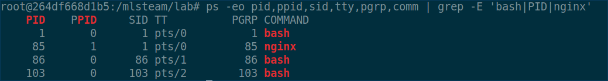
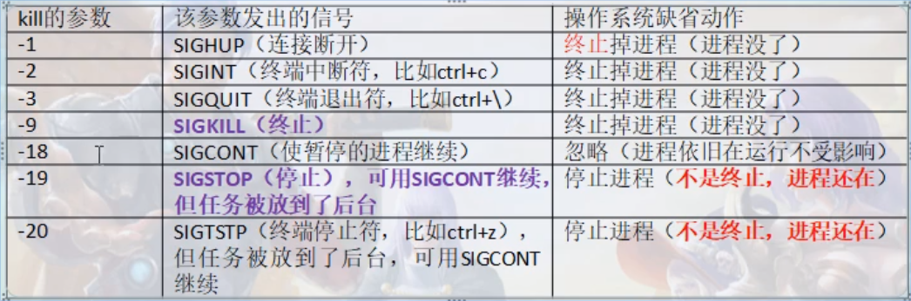
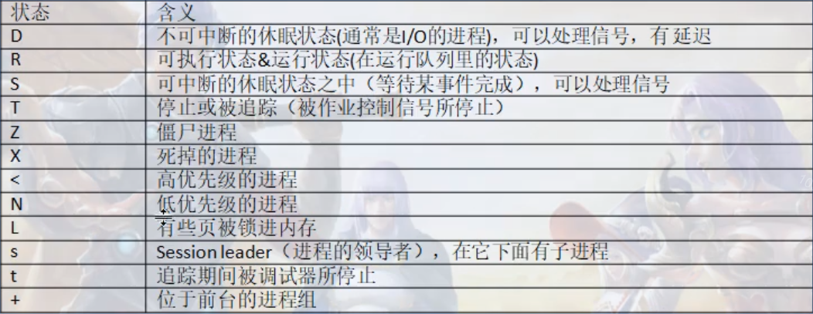

# 信号的概念、认识、处理动作

## 信号（SIG）的基本概念
1. 信号的基本概念  
* 进程之间的常用通信手段：发送信号
* 信号：事情通知，用来通知某个进程发生了一件事情，信号是突发事件，信号是异步发生的，信号也被称为“软件中断”，
2. 信号是如何产生的  
* 信号由a进程发送给b进程，或者a进程发送给a进程
* 由内核（操作系统）发送给a进程，通过终端命令或者终端快捷键、内存访问异常，硬件检测到异常发送给内核，
3. 信号的头文件
* 不同的信号有不同的名字，信号是一些正整数常量（宏定义），
通过命令
```bash
sudo find / -name "signal.h" | xargs grep -in "SIGHUP"
vim /usr/include/x86_64-linux-gnu/asm/signal.h
```
```
xargs的作用是把找到的signal.h文件的内容送到grep的查找管道中
```
 信号头文件中的宏定义
 <details><summary>展开/收起</summary>
<pre><code>
#define SIGHUP           1
#define SIGINT           2
#define SIGQUIT          3
#define SIGILL           4
#define SIGTRAP          5
#define SIGABRT          6
#define SIGIOT           6
#define SIGBUS           7
#define SIGFPE           8
#define SIGKILL          9
#define SIGUSR1         10
#define SIGSEGV         11
#define SIGUSR2         12
#define SIGPIPE         13
#define SIGALRM         14
#define SIGTERM         15
#define SIGSTKFLT       16
#define SIGCHLD         17
#define SIGCONT         18
#define SIGSTOP         19
#define SIGTSTP         20
#define SIGTTIN         21
#define SIGTTOU         22
#define SIGURG          23
#define SIGXCPU         24
#define SIGXFSZ         25
#define SIGVTALRM       26
#define SIGPROF         27
#define SIGWINCH        28
#define SIGIO           29
#define SIGPOLL         SIGIO
/*
#define SIGLOST         29
*/
#define SIGPWR          30
#define SIGSYS          31
#define SIGUNUSED       31

/* These should not be considered constants from userland.  */
#define SIGRTMIN        32
#define SIGRTMAX        _NSIG
</code></pre>
</details>  

4. 通过kill命令认识信号
* 在另一个终端启用正在运行的nginx0容器：
```bash
docker exec -it nginx0 /bin/bash
```
* kill的功能是发送信号给进程，能够发送多种信号给进程，在容器nginx0容器中执行[nginx](./src/nginx.c)程序
```bash
cd /network_programming/Nginx/Chapter3/src/
gcc -o nginx nginx.c   
ps -eo pid,ppid,sid,tty,pgrp,comm | grep -E 'bash|PID|nginx'
```
* 进程信息
```
PID    PPID     SID TT      PGRP COMMAND
1       0       1 pts/0      1 bash
85       1       1 pts/0     85 nginx
86       0      86 pts/1     86 bash
103       0     103 pts/2    103 bash

```


## 通过kill命令认识一些信号
* 使用strace跟踪进程状态
```bash
strace -e trace=signal -p 85
```
strace: Process 85 attached

* 终止id为85的进程
```bash
kill 85
```
* 被跟踪的进程终止后的跟踪状态返回消息
```
strace: Process 85 attached
--- SIGTERM {si_signo=SIGTERM, si_code=SI_USER, si_pid=119, si_uid=0} ---
+++ killed by SIGTERM +++

```
* PID为85、PPID为1的进程接收到PID为119、PPID为0的发送的SIGTERM信号，终止进程执行
* kill -数字 进程id，参数中的数字代表signal.h头文件中的宏定义SIGUP,进程171接收到了145进程发送的SIGUP信号，在父进程132的终端子进程为171的进程终止程序执行，同时被跟踪的进程171也返回了进程被终止的信息
```
PID    PPID     SID TT          PGRP COMMAND
1       0       1 pts/0          1 bash
132     0       132 pts/4        132 bash
145     0       145 pts/5        145 bash
158     0       158 pts/6        158 bash
171     132     132 pts/4        171 nginx
```
```bash
kill -1 171
```
```bash
strace -e trace=signal -p 171
```

```
strace: Process 171 attached
--- SIGHUP {si_signo=SIGHUP, si_code=SI_USER, si_pid=145, si_uid=0} ---
+++ killed by SIGHUP +++
```
* kill -number PID 参考[信号头文件中的宏定义](#信号（SIG）的基本概念)
* kill参数表

## 进程的状态
1. 进程状态表

2. kill只是给进程发送信号，可以发送让进程终止的信号，也可以是让进程暂停或继续执行的信号
##  常用的信号列举
1. 信号表


## 信号处理的相关动作
1. 执行系统默认动作，
2. 编写代码忽略信号（但是不包括SIGKILL和SIGSTOP）
* kill -9 进程id （一定能够把这个进程终止运行）
3. 编写代码捕捉信号（写一个处理信号的函数，同样是不包括SIGKILL和SIGSTOP）

