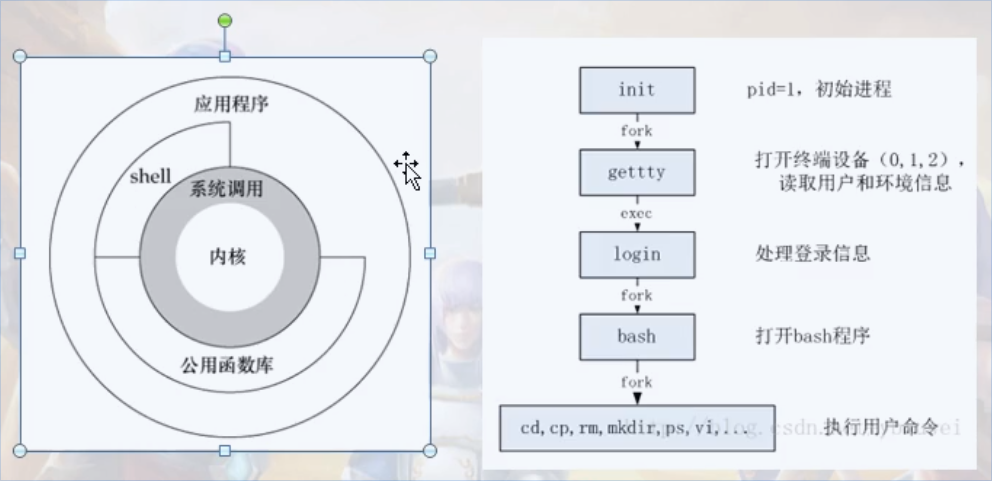

# Unix/Linux体系结构、信号初步编程

## Unix/Linux操作系统体系结构
1. 类Unix操作系统体系结构分为两个状态（用户态、内核态），内核态用来控制计算机硬件资源，提供应用程序运行的环境，用户写的程序一般运行在用户态，当程序需要执行一些特殊的代码的时候，程序很可能切换到内核态，这种切换由操作系统控制，不需要人为介入。
2. 系统调用
* 用户态
* 内核态

## signal函数范例
1. 可重入函数
2. 不可重用函数的错用演示
