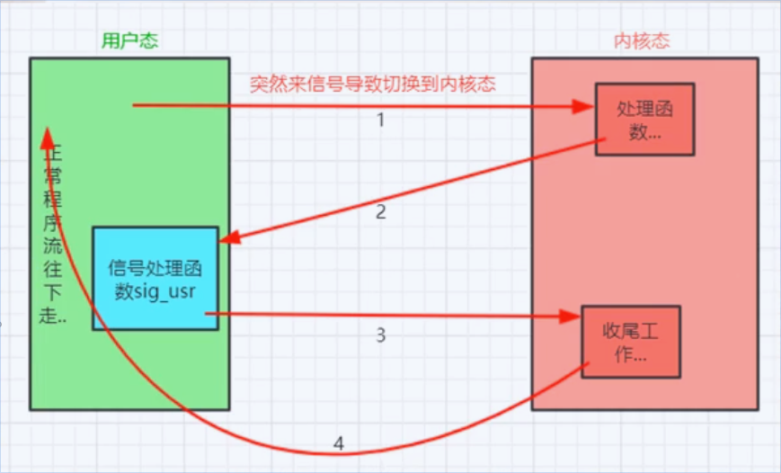
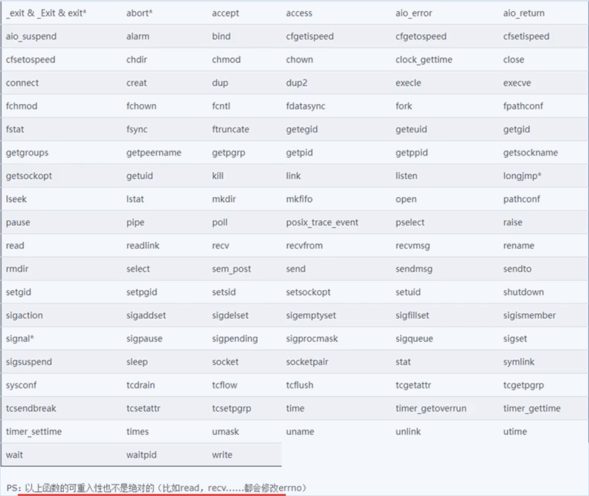

# Unix/Linux体系结构、信号初步编程

## Unix/Linux操作系统体系结构
1. 类Unix操作系统体系结构分为两个状态（用户态、内核态），内核态用来控制计算机硬件资源，提供应用程序运行的环境，用户写的程序一般运行在用户态，当程序需要执行一些特殊的代码的时候，程序很可能切换到内核态，这种切换由操作系统控制，不需要人为介入。
2. 为什么要区分用户态和内核态
* 一般用户写的程序在用户态下运行，当涉及到内核操作的时候，操作系统会做统一管理，用来维护系统的稳定和高效操作体验，

## signal函数范例
使用signal函数来响应接收的信号，也可以忽略接收的信号。
1. 编译并执行../src/nginx3_3_1.c程序
```bash
cd ../src/
gcc -o nginx3_3_1 nginx3_3_1.c
./nginx3_3_1
```
打开另一个终端执行
```bash
ps -eo pid,ppid,sid,tty,pgrp,comm | grep -E 'bash|PID|nginx'
```
显示如下：
```
PID    PPID     SID TT          PGRP COMMAND
  1       0       1 pts/0          1 bash
  132       0     132 pts/4        132 bash
  145       0     145 pts/5        145 bash
  158       0     158 pts/6        158 bash
  201     132     132 pts/4        201 nginx3_3_1
```
执行
```bash
kill -USR1 201
```

程序执行的终端显示如下  
<details><summary>展开/收起</summary>
<pre><code>
休息1秒
休息1秒
收到了SIGUSR1信号！
休息1秒
休息1秒
休息1秒
收到了SIGUSR1信号！
休息1秒
休息1秒
收到了SIGUSR1信号！
休息1秒
休息1秒
收到了SIGUSR1信号！
休息1秒
休息1秒
休息1秒
收到了SIGUSR2信号！
休息1秒
休息1秒
休息1秒
休息1秒
收到了SIGUSR2信号！
休息1秒
休息1秒
</code></pre>
</details> 

如果把nginx3_3_1.c中的代码注释掉
```
   if (signal(SIGUSR2,sig_usr) == SIG_ERR)
    {
        printf("无法捕捉SIGUSR2信号！\n");
    }
```
再执行上述的操作流程，如果操作`kill -USR2 进程id`程序将会终止运行。   
nginx3_3_1.c程序执行流程如下： 
 
如果nginx3_3_1没有收到信号，将按照程序的逻辑顺序执行，当接收到信号时，signal函数将会接收，如果接收到的信号与siginal()的参数匹配，程序则会执行signal()参数中指定的函数的相关操作，否则信号不匹配，程序将终止执行。  
1. 可重入函数
* 概念：可重入函数在信号处理函数中调用是安全的，被称为异步信号安全函数，像malloc(),printf()是不可重入函数，
* 注意事项：  
a) 信号处理函数中尽量使用简单的语句做简单的事情，尽量不要调用系统函数以免引起麻烦，  
b) 如果必须要在信号处理函数中调用系统函数，那么要保证被调用的系统函数一定是可重入的，也就是说是异步信号安全的函数，  
c) 
* 可重入函数表


2. 不可重用函数的错用演示
* 一旦在信号处理函数中用了不可重用函数，可能会导致程序错乱，
* signal()兼容性差，不建议使用，建议使用sigaction()函数代替
* 
